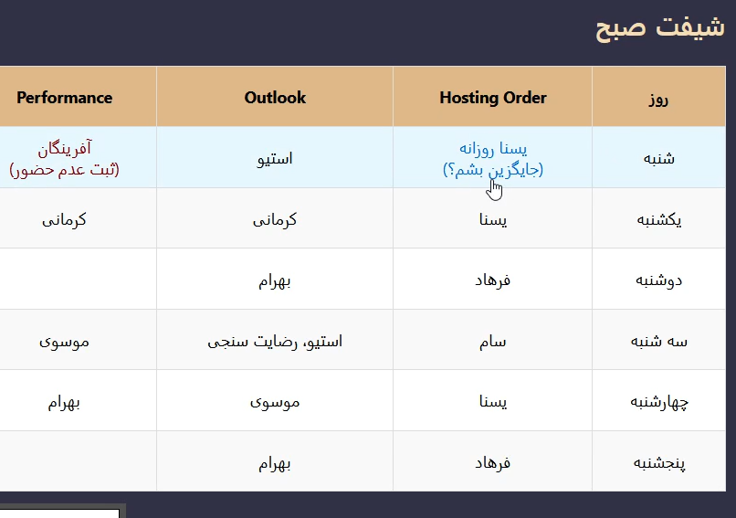

# 🗓️ dailydesk – Smart Shift Scheduling System

**dailydesk** is a Django-based application for managing shift schedules, absence tracking, and replacements in a real-world NOC environment.

🔒 This is a **showcase repo only**. Source code is not shared due to internal usage and privacy policies.

---

## 📸 How It Works (Screenshots)

### 1. Uploading the Shift File via Django Admin
 
Traditionally, team leads were required to manually prepare shift schedules in Excel and repeatedly share them with staff. Employees had to regularly check for changes or updates by referring back to the file or waiting for announcements — which was inefficient, error-prone, and hard to maintain.

With **dailydesk**, the entire shift schedule can now be exported directly from Excel and uploaded via Django Admin. Upon upload, the application automatically parses the file, maps it to internal models, and makes the schedule immediately available on the web UI, preserving the same structure and assignments defined in the Excel file.

This ensures:
- Instant accessibility for all team members
- Zero need for re-entering data
- Improved reliability, especially in critical shift-based environments like NOC or support centers

- Upload Excel file in admin panel  
  

---
 

### Django admin – file upload interface

The upload process is fully integrated into the Django Admin interface, enabling managers or authorized personnel to upload shift Excel files without interacting with the backend or codebase.

By clicking the green **“Add shift excel upload”** button, the administrator can select the prepared Excel schedule file and submit it for processing. Once submitted, the backend automatically extracts structured data from the file and creates database records that power the web interface.

The admin panel provides:

- A clean, secure upload interface
- Validation of the uploaded file format
- Automatic record creation in `Shifts`, `Assignments`, and `Persons` models
- Logically separated models for easier maintainability

  
   
  

  ---

### Uploaded file confirmation

Once the Excel file is submitted via the admin panel, the system immediately processes it and stores it in the database. The uploaded file is displayed in a confirmation list, showing filename and timestamp for full traceability.

Behind the scenes, the backend:

- Parses the Excel sheet into structured data
- Populates relational models such as `Persons`, `Assignments`, and `Shifts`
- Ensures data integrity by validating cell values and headers
- Automatically timestamps the upload for audit purposes

This enables non-technical staff to manage shift data confidently, while the system guarantees accurate backend integration without manual intervention.

  

---

### 2. Web View After Upload

Once the Excel file is parsed and stored, the shift schedule becomes immediately available in a web-based interface. Each row corresponds to a specific day, and columns represent functional responsibilities like monitoring, ticket handling, Outlook support, and server management.

The view is fully dynamic, reflecting real-time data stored in the backend. Users can only interact with the rows that contain their name — for example, user "Afringan" will only see actionable controls next to their own assignments. This ensures data integrity and prevents unauthorized modifications.

While the current styling is functional and readable, the focus of the project was backend logic and workflow automation. The UI is intentionally kept minimal and can be enhanced with modern design components later without changing the system's core logic.

- Shift view rendered on the web  
    
  

---

### 3. User Login & Role-Based Access

Each staff member can log in to their profile using secure, individual credentials. The login system is built on Django's battle-tested authentication framework, which provides robust security features such as:

- Secure session management
- Encrypted password storage
- CSRF protection by default
- User-based permission system

Once logged in, users are restricted to their own data. For instance, a user will only see shift actions related to themselves (e.g., reporting absence or confirming replacement), while the rest of the schedule remains read-only.

🔒 **Admin Access Control**  
Only users with elevated permissions (e.g., staff or superuser) can access the Django Admin panel at `/admin/`. Regular users — even when logged in — do **not** have access to the user management interface or any global controls. This separation ensures operational integrity and limits exposure to sensitive data.

The system is also ready for future expansion to token-based authentication (e.g., JWT, OAuth2) or API-based integration with other internal tools — thanks to Django’s extensible auth architecture.

- Login page  
  

- User creation in admin  
  

- User list in Django admin  
  

---

### 4. Absence & Replacement Features

- Marking absence  
  

- Disable/Enable users  
    
    
  

- Visual feedback  
    
  

---

## ✅ Features

- Excel shift plan → Web view (auto parsed)
- User authentication and access control
- Absence reporting with live update
- Auto-replacement mechanism (only one replacement allowed)
- Visual indicators for status updates
- Admin user control (enable/disable)

---

## 🧩 Tech Stack

- **Python** + **Django**
- **Django Admin** for uploads and user control
- **Excel parser** via `openpyxl`
- Responsive HTML frontend (auto-generated views)

---

## 📌 Note

This system was actively used in a professional data center team.  
The UI is fully dynamic, and shift handovers are visually tracked and controlled.

> If you’re hiring for a DevOps, infrastructure, or backend role, feel free to contact me for more information about this project.
